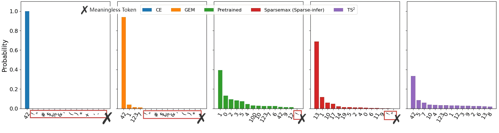

# Official Implementation of TS2

This is the **official PyTorch implementation** of **TS2**, which introduced in our [ICLR 2026 paper](https://openreview.net/pdf?id=CylRqa82Rk) **"TS^2: Training with Sparsemax+, Testing with Softmax for Accurate and Diverse LLM Fine-Tuning"**

We found a noval way to fine tune the SFT, which could preserving diversity during SFT.


---

## Quickstart

### 1. Environment Setup
We provide an environment file including the python package versions we used in our experiments [env.txt](./asset/experiment_env.txt). For optimal reproducibility, we recommend using the same package versions. However, please note that results may still vary due to differences in hardware configurations and CUDA versions, etc.
But you could still use the following scripts for a quick beginning.

Create the environments for **training(flash-attn)** and **testing(vllm)**:

```bash
bash train_env_setup.sh
bash test_env_setup.sh
```

### 2. Preparation

#### Load Data and Base Model

```bash
python prepare_work/load_dataset.py
python prepare_work/load_model.py
```

#### Tokenize Data

```bash
bash tokenize_data.sh
```

---

### 3. Training

Start training using the **UltraFeedback** dataset from HuggingFace:

```bash
conda activate ts2-train
bash train_ts2_ultrafeedback.sh
```

---

### 4. Evaluation
Start testing enviroment
```bash
conda activate ts2-test
```
Evaluate the model on multiple benchmarks:

**AlpacaEval(Chat Task):**

```bash
bash instruction_follow_task.sh
python calculate_winrate.py
```

**HumanEval(Code Generation Task):**

```bash
bash code_generation_task.sh
```

**Story & Poem Generation:**

```bash
bash creative_writing_task.sh
```

**OpenLLM Leaderboard Evaluation:**

```bash
bash openllm_eval.sh
```

---
## Released Models
We release the following models that are built on top of the strong meta/llama3.1-8b model by training on the dataset HuggingFaceH4/ultrafeedback_binarized.

[xzybit/llama3.1-8b-ts2](https://huggingface.co/xzybit/llama3.1-8b-ts2)


## Citation

This is the citation of original project:

```bibtex
@inproceedings{li2025preserving,
  title={Preserving Diversity in Supervised Fine-Tuning of Large Language Models},
  author={Ziniu Li and Congliang Chen and Tian Xu and Zeyu Qin and Jiancong Xiao and Zhi-Quan Luo and Ruoyu Sun},
  booktitle={The Thirteenth International Conference on Learning Representations},
  year={2025},
  url={https://openreview.net/forum?id=NQEe7B7bSw}
}
```
